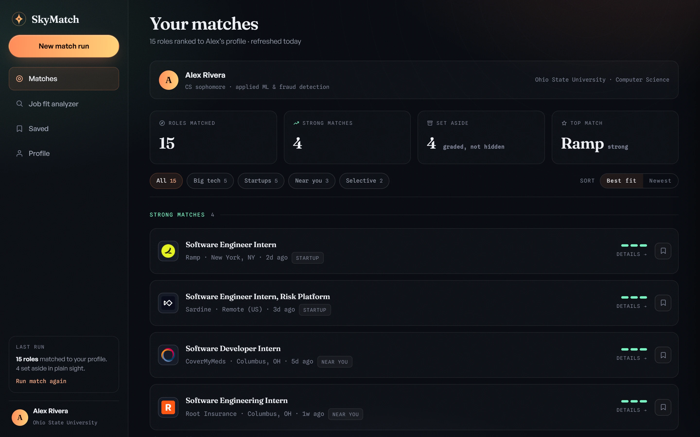
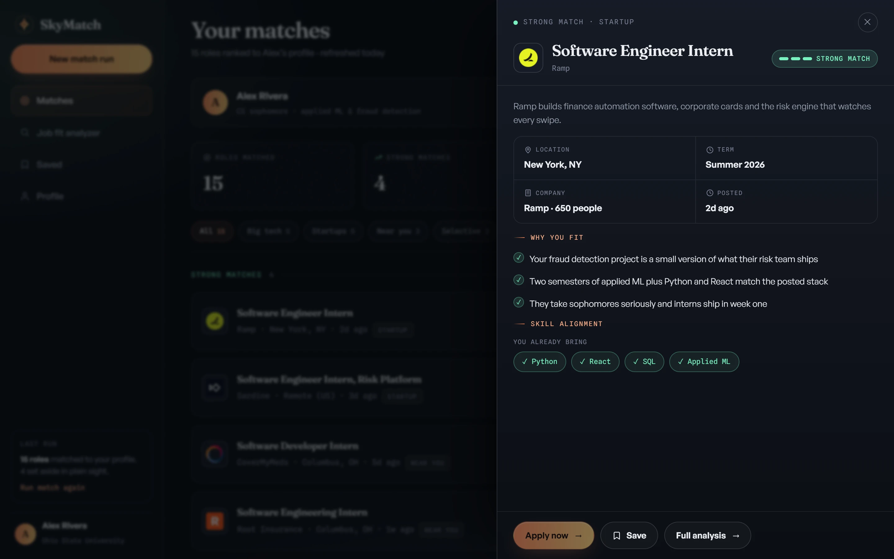
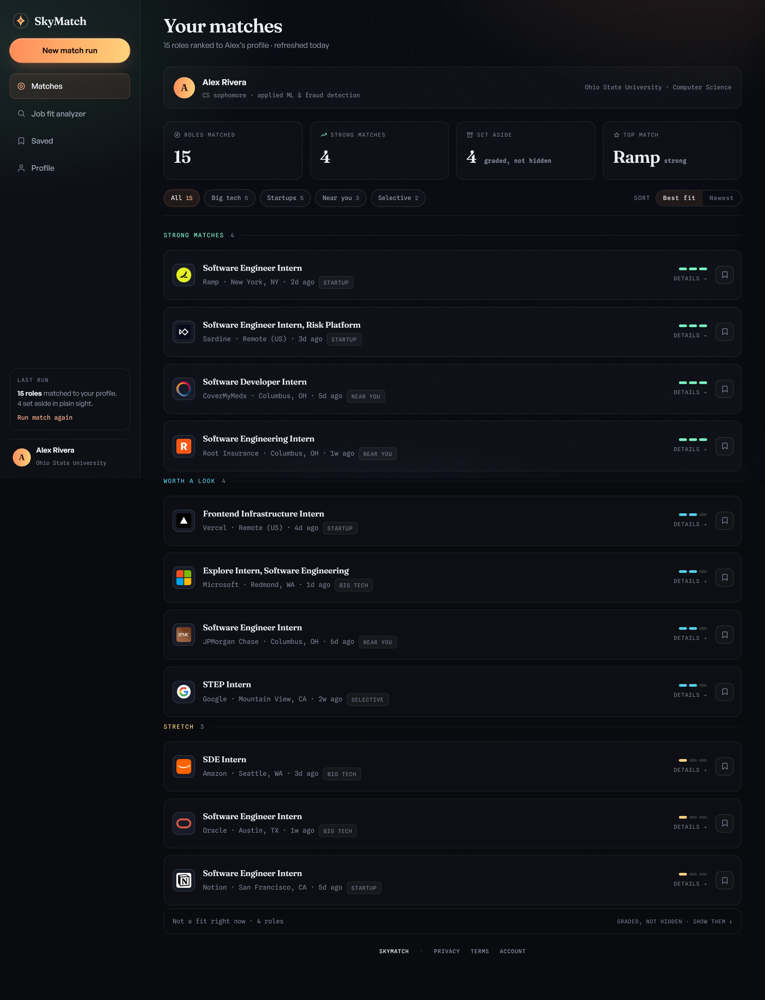
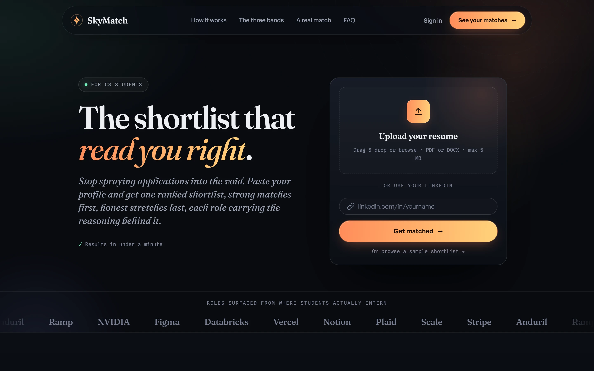
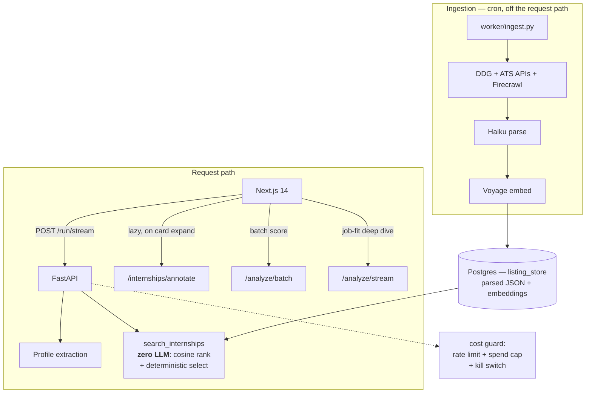

# SkyMatch

**Paste a LinkedIn profile or résumé, get a shortlist of internships scored honestly against your actual background — with the reasoning attached to every role.**

[](https://github.com/christianlofaso/Pathfinder/actions/workflows/ci.yml)


> Full-stack side project. FastAPI + Next.js + Postgres, with a standalone ingestion worker and a
> cost-governance layer wrapped around three Claude models. The codebase is named `pathfinder`;
> the product is SkyMatch.



<details>
<summary><b>More screenshots</b> — the role drawer, the landing page, and the full feed</summary>

<br>

**Role drawer** — every match shows its work: why it landed where it did, which requirements are
already met, and what is left to close.



**The full feed** — all three bands plus the collapsed "not a fit right now" block, which grades
poor matches in plain sight rather than silently dropping them.



**Landing page.**



</details>

---

## Try it in 30 seconds — no API keys, no database

The repo ships a complete pre-computed sample run, so you can see the real UI without provisioning
anything:

```bash
cd frontend && npm install && npm run dev
```

Open <http://localhost:3000> and click **"Or browse a sample shortlist"**.

That path renders the genuine feed, banding, role drawer, and analyzer against a captured run
stored in [`frontend/src/lib/demoRun.ts`](frontend/src/lib/demoRun.ts) — pre-scored and
pre-annotated, so it makes **zero backend calls** and costs nothing. No `.env.local` needed; auth
and the API client both degrade to off when their env vars are absent.

To run the real pipeline against your own profile, see [Running the full stack](#running-the-full-stack).

---

## The interesting part

The product is a job matcher. The engineering problem is that the obvious implementation — call an
LLM per role, per request — is slow, costs money proportional to traffic, and gets *less* reliable
as it scales. Most of the work here is about not doing that.

### Ingestion is decoupled from serving

A standalone worker ([`backend/worker/ingest.py`](backend/worker/ingest.py), cron ~8h) does the
expensive work ahead of time: scrape job boards and ATS APIs, parse each listing with Haiku, embed
it with Voyage, and write it into a Postgres index.

The request path then reads that index. `search_internships` fires **zero LLM calls** — it embeds
the profile once, cosine-ranks it against the stored listing vectors, and runs a deterministic
selection pass. The per-role "why you fit" text is deferred and fetched lazily when a card is
expanded, so a 15-role feed costs one embedding call instead of fifteen completions.

Measured end-to-end `/run` latency after the last optimization pass: **~38s → ~21s**
([`docs/audit-fixes.md`](docs/audit-fixes.md)).

### Cost is treated as a failure mode, not a line item

A personal project with a public URL and a card on file is one bug away from an expensive weekend.
[`backend/lib/guard.py`](backend/lib/guard.py) implements:

- **A rolling spend cap with an automatic kill switch** — gated routes return 503 once the window's
  spend hits the cap. It defaults to a non-zero `$25/day` so a forgotten env var fails *closed*
  rather than open, and the effective cap is printed at startup.
- **A separate worker spend bucket**, so ingestion can never trip the user-facing kill switch.
- **Per-IP sliding-window rate limiting + a concurrency cap.**
- **A Redis ZSET semaphore** bounding global in-flight Sonnet calls across replicas. Slots are
  TTL-stamped and reclaimed, so a crashed replica's slot self-heals instead of deadlocking the
  governor — the reason it isn't a plain `INCR`/`DECR` counter. It degrades to an in-process
  semaphore when Redis is absent.
- **A persistent cost ledger** with per-model and per-session breakdowns at `/cost/summary`.

### Three models, routed by what the task is worth

Opus for the deep gap-analysis roadmap, Sonnet for selection and annotation, Haiku for
high-volume listing parsing and quick verdicts. Model IDs are centralized in
[`backend/config/models.py`](backend/config/models.py).

### Scoring calibration as an explicit problem

The first version of the quick verdict produced a bimodal distribution — one real profile scored
12/15 roles `apply_now` and 3 `skip`, with nothing in between — which collapsed the UI's three
readiness bands into a single undifferentiated pile and told a no-experience first-year to apply
now to competitive hardware roles.

The fix was twofold: give the middle verdict an explicit score band with worked calibration anchors
in the prompt (including a deliberate over-optimism counter-example), and make the *verdict* rather
than the raw score drive banding. Written up with before/after in
[`docs/audit-fixes.md`](docs/audit-fixes.md).

### Streaming and caching throughout

Long routes stream newline-delimited JSON so the UI fills in progressively instead of blocking on a
90-second request. The cost and auth gates are per-router `yield` dependencies rather than
middleware — specifically so they don't buffer the streaming responses. Analyses are cached by
content hash, annotations for 30 days, and the results page dedupes by application URL before batch
scoring so a URL is never scored twice.

---

## Architecture



**Backend** — Python 3.12, FastAPI, Anthropic SDK, Postgres via `psycopg` v3 + `psycopg_pool` with
Alembic-owned schema, Redis (optional), Pydantic v2, Voyage embeddings, Firecrawl.
**Frontend** — Next.js 14 App Router, React 18, TypeScript, Tailwind, Zod.
**Infra** — Railway (web + worker cron + Redis), Supabase Postgres, Vercel, GitHub Actions CI.

---

## Running the full stack

Needs Docker and Python 3.12. An Anthropic API key is required; the rest are optional and degrade
gracefully when absent (no Voyage key → ranking is skipped, no Firecrawl key → JS-rendered pages are
skipped, no Supabase → auth is off entirely).

```bash
cd backend
cp .env.example .env          # then set ANTHROPIC_API_KEY at minimum
docker compose up -d db       # local Postgres on :5432
python -m venv venv && venv/Scripts/activate
pip install -r requirements.txt
alembic upgrade head          # schema is owned by Alembic, not init_db()
python -m worker.ingest       # populate the index — run this BEFORE the first /run
uvicorn main:app --reload --port 8000
```

```bash
cd frontend && npm install && npm run dev
```

The ingestion worker must run at least once before the first `/run`, or the national buckets serve
empty by design (the index is the only source).

---

## Repo layout

```
backend/
  routes/       /run, /analyze, /internships, /profile, /connections
  lib/          guard, auth, anthropic_client, embeddings, firecrawl, precompute
  worker/       standalone ingestion (not in the request path)
  config/       model IDs, niches/metros, resource allowlist
  prompts/      system prompts, incl. the calibration anchors
  alembic/      schema migrations
frontend/src/
  app/          App Router pages — landing, results, analyze
  components/   feed, role drawer, landing
  lib/          api client, storage, banding, demoRun
docs/           deep reference — see below
```

| Doc | Covers |
|-----|--------|
| [architecture.md](docs/architecture.md) | deep design, project tree, gate internals, env inventory |
| [routes.md](docs/routes.md) | every endpoint, orchestration, the URL-validation drop policy |
| [data-models.md](docs/data-models.md) | exact Pydantic/Zod shapes |
| [caching.md](docs/caching.md) | cache keys, TTLs, Postgres tables |
| [gotchas.md](docs/gotchas.md) | async traps, truncation, Cloudflare walls — read first |
| [audit-fixes.md](docs/audit-fixes.md) | the cold-user audit: each problem, fix, and verification |
| [deploy.md](docs/deploy.md) | Vercel + Railway + Supabase, CI, staging→prod promote |

---

## Project status

A personal project, built solo over about a month, and honest about where it stopped:

- **Not currently hosted.** The staging deployment is down and the ingestion cron is paused, so
  nothing is consuming API credits. The sample-shortlist demo above is the intended way to see it.
- **Connections are dormant.** `/run` computes internships only; `connections.py` and its UI are
  retained but unwired.
- **Ingestion coverage is uneven** across metros — the national buckets are seeded broadly, but
  `local` only covers metros in the rotation.
- **No automated test suite.** CI byte-compiles the backend, smoke-tests app wiring, and
  type-checks the frontend; correctness was verified manually against live data and written up in
  `docs/audit-fixes.md`. This is the gap I'd close first.

UI design explorations (fourteen iterations, mockups, screenshots) live on the
[`design-history`](../../tree/design-history) branch, kept off the default branch so this one reads
as the application.

## License

MIT — see [LICENSE](LICENSE).
